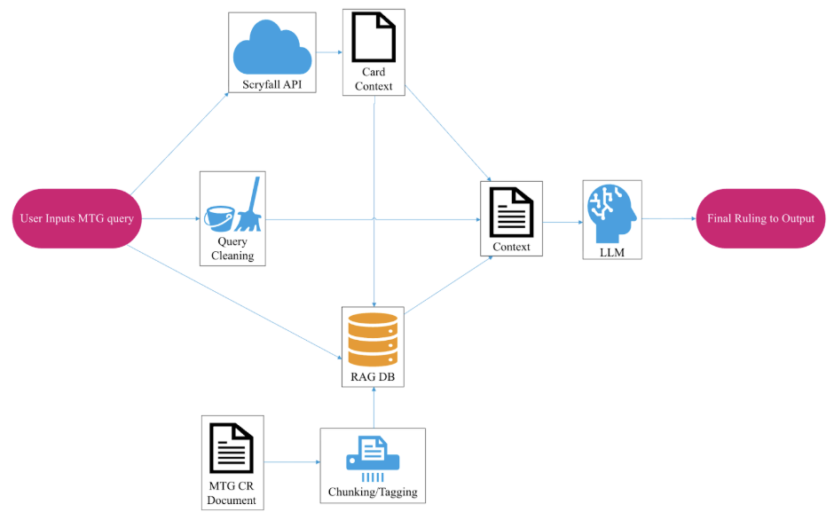
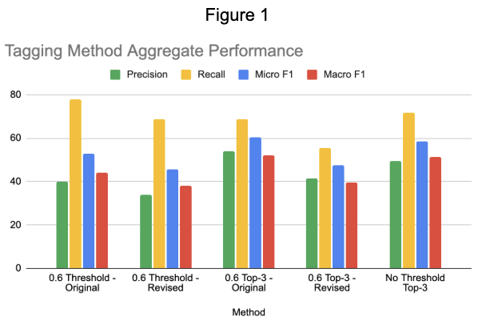
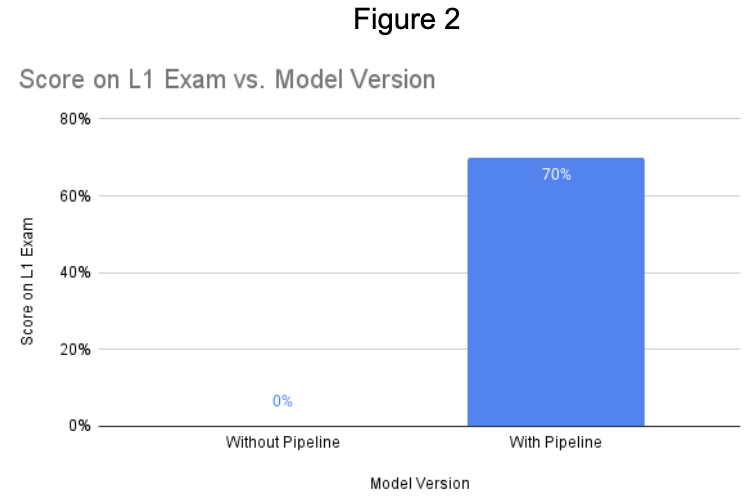
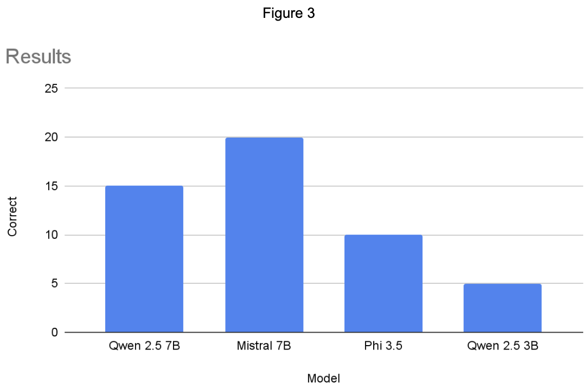

## Video  

<iframe width="560" height="315" src="https://www.youtube.com/embed/GUJQ3JnNn7I?si=WB0RxTDs43ERWRrF" title="YouTube video player" frameborder="0" allow="accelerometer; autoplay; clipboard-write; encrypted-media; gyroscope; picture-in-picture; web-share" referrerpolicy="strict-origin-when-cross-origin" allowfullscreen></iframe>

## Project Summary
<!-- Short paragraph: main idea, further updated/clarified from status. -->
Magic: The Gathering has a rules document that is over 300 pages long. Not only are the rules themselves innumerable, the interactions between them can be arcane and unintuitive. The process of becoming a Magic: The Gathering judge involves intense study of these documents, taking a long series of exams, and working as a lower-rung judge without pay until you’re qualified to field a tournament. Because of the high standard of qualifications and the low incentives beyond love for the game, there is a severe shortage of even L1 judges, the lowest tier of officially recognized judges.

Local game stores need judges to run tournaments to get traffic to their stores, but there aren’t enough judges to go around and officially judge a tournament. It seems to follow that LLMs could serve to alleviate a shortage of labor in a domain based on interpreting natural language. However, most commercially available LLMs are extremely poor in their interpreting of rules. Many questions asked involve rules that aren’t necessarily semantically related to the query itself. The following text is a query made to OpenAI’s ChatGPT in the style of a judge exam, and its incorrect response.

User: “Alessandra controls Mox Opal and Trinisphere. Alessandra casts another Mox Opal. After it resolves, can they tap it for mana before it's put into their graveyard?“  
LLM Response: “Yes — Alessandra can tap the new Mox Opal for mana before it goes to the graveyard.”

The correct answer is that Alessandra cannot tap the new Mox Opal, and it has to do with when the state-based action of the legend rule resolves; this mechanic isn’t mentioned at all in the query, and it is on the LLM to figure that out itself. This requires the LLM to have a functional understanding of the rules of Magic: The Gathering, direct access to the text of relevant cards, and the ability to reason about these context elements in tandem. Commercially available LLMs do not have these facilities.

Our goal was to develop a system exploiting modern advancements with vector embeddings of text to create an automated Magic: The Gathering judge that could pass the L1 judge exam. Our plan to accomplish this was by making a pipeline to provide relevant context to an LLM specifically designed for reasoning on rule and card content. This judge was to output clear, concise, and correct rulings, and allow local game stores to field tournament participant questions programmatically. 

## Approach
<!-- Detailed description: method, data structure, sampling, loss(es); how it applies to your scenario (inputs/outputs, data size, hyperparameters); cite sources; use figures/tables as appropriate. -->

  

The image above is a diagram of the pipeline we created to provide context to our LLM. Each individual portion will be explained.

On the far left, the user will input a query to the system. Relevant card details will be surrounded in double square brackets, as is a standard in most Magic: The Gathering online communities (e.g. “[[Mox Opal]]”). The card names in these brackets are extracted and stored before the query is passed in for cleaning. Cleaning removes the extraneous formatting in the query so that the question can be passed in a format as close to natural language as possible. This unformatted query is then passed into the context generator.

The extracted card names are passed to the Scryfall API. Scryfall is a web database containing comprehensive card information, and is a well trusted source in Magic: The Gathering communities. We retrieve from the API the oracle text and relevant rulings. The oracle text is the official source of the card’s effect which does sometimes differ from the text on the card itself, especially for older cards. The relevant rulings are rules sources specific to cards that sometimes make specific clarifications, and sometimes provide rule exceptions to maintain card behavior as oracle text is updated over time. The oracle text and rulings are compiled into a string and passed into the context generator.

The Magic: The Gathering Comprehensive Rules document is a total description of all relevant rules. The document is highly regular, as the topics and sections follow a hierarchical structure as described in the following table.  

---  

#### Magic: The Gathering Comprehensive Rule Document Hierarchy

| Name | Example |
| -- | ----- |
| Topic | 1. Game Concepts |
| Section&nbsp;&nbsp;&nbsp;&nbsp;&nbsp; | 104. Ending the game |
| Rule | 104.2 There are several ways to win the game. |
| Subrule | 104.2b An effect may state that a player wins the game. |  

---  

Based on this, we made a stateful parser that tracked what level in the hierarchy we were in, as well as the text of all sections higher in the hierarchy. For example, subrule 104.2b would be stored with a reference to rule 104.2 as well as being tagged as a member of “104. Ending the game” and “1. Game Concepts”. We use this chunking to generate rule documents out of the rules and subrules, connecting subrules to rules as well as both kinds of rules to their sections and topics via metadata. We insert these documents into a LlamaIndex vector store with a ChromaDB backend.

After the documents are placed into the vector store, we do one last sweep to modify their metadata with tags explaining what systems they are a part of. We use zero-shot classification with facebook/bart-large-mnli to tag them. The predicates used and their associated tags are found in the following table.  

---  

#### Final Predicates

| Tag | Predicate |
| --- | --- |
| combat | This Magic: The Gathering rule is about combat |
| casting | This Magic: The Gathering rule is about casting |
| mana | This Magic: The Gathering rule is about mana |
| abilities | This Magic: The Gathering rule is about card abilities |
| state-based actions&nbsp;&nbsp;&nbsp;&nbsp; &nbsp;  | This Magic: The Gathering rule is about state-based actions |
| continuous effects | This Magic: The Gathering rule is about continuous effects |
| priority | This Magic: The Gathering rule is about priority |
| stack | This Magic: The Gathering rule is about the stack |  

---  

The zero-shot classification model returns a confidence in the predicate from 0 to 1. We compile a list of the scores and then filter down to the tags for which the confidence was over 0.6. From this filtered set of tags, we take a maximum of 3 of the highest scoring tags from this filtered set. This ensures that rules have appropriate tags, but it heavily limits the amount of rules that get overtagged. This ChromaDB vector store with metadata containing system tags and structural data was our RAG source. How we came to use this specific tagging strategy will be discussed in the evaluation section.

The query is then passed into our RAG database to make a search for relevant rules. Before the rule is given to the database, we tag it in an identical process to the rules. The only difference is we replace the word “rule” with “question” in the predicate. The same tags are used. The first step of retrieval is metadata filtering. Only rules that contain at least one of the tags given to the query are considered for retrieval. On this filtered set, vector similarity search is done between the embedding of the query and the embedding of the individual rules in the filtered set as generated by all-mpnet-base-v2. We take the top 10 rules from the similarity search, and we return the entire rule + subrule group for the 3 highest scoring documents in the top 10. These rules and subrules are stored in a string and are passed into the context generator.

The context generator takes the oracle text and relevant rulings from the Scryfall API, relevant rules from the RAG database, and the cleaned user query, formatting it using markdown. All of the text is grouped into headers and compiled into one large prompt for the LLM. The LLM will then attempt to answer the question using the context provided to it.

## Evaluation:  

Given this system design, there were two individual elements of the pipeline that we found were highly responsive to small changes and incredibly relevant to the overall performance of the system. These elements are the tagging strategy and the final LLM. The different tagging strategies will be discussed first. After that, a singular tagging strategy will be chosen and then different LLMs will be evaluated given their performance on an L1 exam with the chosen tagging strategy.  

Tagging Method Aggregate Performance (Figure 1) measures the quality of the different tagging approaches we took. The groupings represent different tagging strategies we evaluated. These strategies were evaluated on a benchmark of 50 rules manually tagged by the members of the group before coming to consensus. The specifics of the tagging strategies will be found in the table below. The revised predicates mentioned in the table will be in the following table.  

  

The formula used for Micro F1 and Macro F1 are as follows. 

$$
F1_{\text{micro}} = \frac{2 \sum_{i=1}^{N} TP_i}{2 \sum_{i=1}^{N} TP_i + \sum_{i=1}^{N} FP_i + \sum_{i=1}^{N} FN_i}
$$  
$$
F1_{\text{macro}} = \frac{1}{N}\sum_{i=1}^{N} F1_i
$$  

Here, threshold represents the minimum confidence score a tag needed to have to be considered by the collection strategy. The collection strategy was either collecting the top 3 of the scores that passed the threshold or collecting all that passed. The predicates refer to whether the predicates in the Final Predicates table were used, or a different, more specific set of predicates found in the Revised Predicates table.  

---

#### Tagging Strategy Descriptions

| Name | Threshold&nbsp;&nbsp;&nbsp;&nbsp;&nbsp; | Predicates&nbsp;&nbsp;&nbsp;&nbsp;&nbsp; | Collection Strategy |
| --- | --- | --- | --- |
| 0.6 Threshold - Original | >= 0.6 | Final | Threshold only |
| 0.6 Threshold - Revised&nbsp;&nbsp;&nbsp;&nbsp;&nbsp; | >= 0.6 | Revised | Threshold only |
| 0.6 Top-3 - Original | >= 0.6 | Final | Threshold + top 3 |
| 0.6 Top-3 - Revised | >= 0.6 | Revised | Threshold + top 3 |
| No Threshold Top-3 | >= 0.0 | Final | Threshold + top 3 |

---

#### Revised Predicates

| Tag | Predicate |
| --- | --- |
| combat | This Magic: The Gathering rule is about combat. This is related to attacking and blocking. |
| casting | This Magic: The Gathering rule is about casting. Instants, sorceries, creatures, artifacts, enchantments, planeswalkers, and battles are all spells. |
| mana | This Magic: The Gathering rule is about mana |
| abilities | This Magic: The Gathering rule is about card abilities. Abilities are effects that cards have. If it involves a keyword that instills a card with an effect, it’s an ability. |
| state-based actions&nbsp;&nbsp;&nbsp;&nbsp; | This Magic: The Gathering rule is about state-based actions |
| continuous effects | This Magic: The Gathering rule is about continuous effects |
| priority | This Magic: The Gathering rule is about priority |
| stack | This Magic: The Gathering rule is about the stack |  

---  

As could be expected, the strategies that limit the amount of tags in a query (top-3) have lower recalls than the strategies that do not (threshold). However, the top-3 strategies tend to have notably higher precision than threshold. A notably interesting result was that in both cases, using the more specific, revised predicates resulted in lower scores on all metrics. This could be explained by the predicates introducing more concepts to the zero-shot classifier that are mostly unclear, rather than just relying on context clues and strong semantic association between words (“attack” and “combat", “sorcery” and “casting”). We are using Micro and Macro F1 as our measures of true domain accuracy because they meaningfully consider both precision and recall as relevant factors. Despite top-3 strategies taking a hit to recall, their large gains in precision offset this. The “0.6 Top-3 - Original” strategy beats the other tagging strategies on both Micro F1 and Macro F1. As such, it was selected as our final tagging strategy, and was used to create the RAG database and query tagger that would provide context to the LLM.  

Figure 2 is a graph representing the improvement on an LLM’s score on a small snippet from the beginning of the L1 judge exam taken from much earlier in our project. We were using Qwen 2.5 7B to take the test. While this does not represent the final scope of our project, we felt it necessary to check that our pipeline meaningfully improved performance of the LLMs we tested our pipeline with instead of just measuring some general reasoning capabilities between different open-source models.  

We compared 4 modern, well rated, open-source LLMs available on HuggingFace. Figure 3 represents scores of these 4 LLMs on a publicly available L1 practice exam. The y-axis represents the number of questions correct out of 25. Each of these LLMs received context supplied to them by our pipeline with the “0.6 Threshold - Original” tagging strategy. Mistral 7B performed the best of the 4 LLMs, reaching an 80% accuracy. This not only meets the passing 70% score requirement to qualify as an L1 judge, but meets the 80% threshold to take the exam to become an L2 judge. Quantitatively, we can call this tentative success.  

After compiling the data, we looked at the specific questions that the models got wrong. Often the models other than Mistral would hallucinate card data even when the specific cards they were referencing were provided to them. For example, this is a snippet of a response from Qwen 2.5 3B.

---

**Question:** “Amy controls [[Trinisphere]] and a [[Sphere of Resistance]]. There are 9 creatures on the battlefield. What does Amy have to pay to cast [[Blasphemous Act]]?”  
**Quen 2.5 3B**: “...   4. *Calculating Final Cost*: With Trinisphere's effect, the cost of Blasphemous Act is increased to three mana per creature on the battlefield. Since there are 9 creatures, the total cost is \(9 \times 3 = 27\) mana.”

---

Trinisphere Oracle Text:
As long as this artifact is untapped, each spell that would cost less than three mana to cast costs three mana to cast. (Additional mana in the cost may be paid with any color of mana or colorless mana. For example, a spell that would cost {1}{B} to cast costs {2}{B} to cast instead.)  
Hallucinations like these are common throughout Phi 3.5 and Qwen 2.5 3B’s answers. The failure modes of Mistral 7B were more specific. Continually, Mistral was confused by generally accepted Magic: The Gathering terminology. To show this, a snippet of a response from Mistral 7B will be shown.

---

**Question:** “Amy casts [[Fodder Launch]] targeting Nick’s [[Grizzly Bears]]. In response, Nick activates [[Bazaar Trader]] targeting [[Grizzly Bears]]. What happens?”  
**Mistral 7B:** “First, we'll apply the replacement effect from Fodder Launch… Next, we'll apply the replacement effect from Bazaar Trader…”

---

“In response” is widely known to mean “on top of on the stack, such that it resolves before what it was cast in response to” by Magic: The Gathering players. However, Mistral 7B continually interpreted the phrase “in response” to mean “cast after the spell in question, such that it resolves afterwards”. Out of the 5 questions that Mistral 7B got wrong, 2 of them were due to incorrect resolution order from the misinterpretation of the phrase “in response”. This failure mode, along with the occasional failure of one-shot RAG, as well as the fundamental issue with using the user query to generate relevant rules had led us to believe that while the pipeline approach has led to small successes, further improvements to our project would require major architectural changes.

Instead of structuring our program as a pipeline that generates context in one shot to feed into an LLM, we’d structure it as an ecosystem of tools that a tool-calling agent could utilize to pull context to follow an internal chain of reasoning. We’d be able to have the LLM focus on an understanding of the general game flow in order to ask better questions with tool calling as opposed to evaluating the relevant and piecing together 15+ rules at a time along with card content. Moving both the RAG and the Scryfall API to a tool-calling approach would allow the model to refresh itself on relevant card details when needed to reduce hallucinations as well as make better structured query to the RAG database in order to find relevant rules, instead of relying on the user to make clearly structured queries and use the needed keywords (“legend rule” in the example in Project Summary). This new tool calling approach would also eliminate the need for user query tagging, as well as allow us to safely transition into more specific tagging for better metadata filtering during retrieval.

Overall, we achieved our reasonable goal of creating a system that can pass an L1 judge exam. However, when we continue our work on this project, we believe that our initial architecture decisions were somewhat short sighted, and we work to formalize a better approach that mimics real judge behavior as best as possible.

## Resources Used
<!-- Code docs, libraries, source code, StackOverflow, etc. Include a comprehensive description of any use of AI tools. -->
[ChromaDB](https://www.trychroma.com/)

[LlamaIndex](https://pypi.org/project/llama-index/)

[PyTorch](https://pytorch.org/)

[FAISS](https://pypi.org/project/faiss/)

HuggingFace Models (specifically [all-mpnet-base-v2](https://huggingface.co/sentence-transformers/all-mpnet-base-v2), [bart-large-mnli](https://huggingface.co/facebook/bart-large-mnli), [Mistral-7B-Instruct](https://huggingface.co/mistralai/Mistral-7B-Instruct-v0.3), [Phi-3.5](https://huggingface.co/microsoft/Phi-3.5-mini-instruct), [Qwen2.5-7B-Instruct](https://huggingface.co/Qwen/Qwen2.5-7B-Instruct), and [Qwen2.5-3B-Instruct](https://huggingface.co/Qwen/Qwen2.5-3B-Instruct))

[Scryfall API](https://scryfall.com/docs/api)

### AI Usage

Commercial LLMs were used in the process of iterating on the specific implementations of system designs we tested, but the design of the pipelines themselves and research into relevant techniques were all done manually. 

