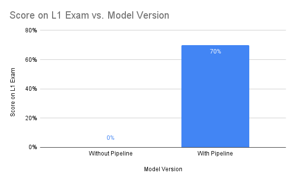
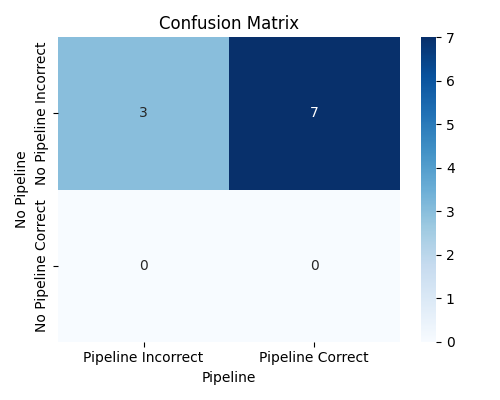

## Project Summary

<!-- Short paragraph: main idea, updated/clarified from proposal. -->
Magic: The Gathering has a large corpus of rules, and niche interactions between the precise wordings of rare subrules are par for the course. Interpreting these rules is hard enough that you have to pass an exam to be even an unofficial judge. We propose an LLM-based system that will leverage available APIs, chained LLMs, and retrieval-augmented generation (RAG) in vector databases to provide accurate rulings above the quality of standard commercial LLMs.

## Approach

<!-- Detailed description: method, data structure, sampling, loss(es); how it applies to your scenario (inputs/outputs, data size, hyperparameters); cite sources; use figures/tables as appropriate. -->
We use open-source HuggingFace LLMs chained together in a sequence along with other steps to both ensure quality input, quality output, and provide better internal context. Specific HuggingFace models used at the time of writing are “all-mpnet-base-v2” for embeddings and for actual text generation, but these are subject to change as we iterate.

To set up the system, we had to chunk the given Magic: The Gathering rules document into a vector database. We used a stateful parser with lots of regex to separate the document into individual rules and subrules. The statefulness of the parser was to allow for the creation of metadata. This metadata will be very important later, as it allows for much better rule retrieval in the RAG step. A ChromaDB client is set up in-memory to host this database. Along with the metadata from the structure of the document, we tag the system that the rule interacts with, as well as the kind of information imparted by the rule. The columns only contain the text of the rule with the rule number itself removed, the metadata, and the embedded vector of the text of the document. 

First, a query is taken from the user, formatted as a question about MTG rules. The user is expected to format card names as “[[Card Name]]” at least once for each card in the query to allow our system to detect the card name. The card name is extracted from the query, and a request is made to the ScryFall API for the exact text and relevant rulings of the card(s) mentioned in the query. While this is happening, the query is being processed through a smaller LLM we have to rewrite the query in a more canonical form. This ensures better performance when combined with the RAG system.

Then, a query is made to the RAG system. The text of the query used is the text retrieved from the query rewriter. This query involves tagging the query with the relevant systems, and filtering on this metadata. We gather the top 20 results from the filtered database. Each result is a sectioned off subrule. For the top three, we gather the entire rule (i.e. the rule title along with all other subrules), as these are likely to be relevant. We also include the remaining 17 subrules without additional rules with them because we have the space in context for them. The output of our RAG system is 3 full rules and 17 subrules appended together in a string.

Using the context gathered from the Scryfall API query and the relevant rules from the RAG system, we run two inferences. Both inferences have the same prompt, and we rely on the temperature in the LLM to produce different responses. We run both of these queries through an LLM outputting forced format booleans to pick the “better output” on a number of criteria, including tone, correctness, conciseness, and clarity. We are also iterating on a final step that would involve running this better output through a final LLM that would rewrite the answer to ensure output that better aligns with the criteria aligned above, or using this to entirely skip the double inference. This final output is then presented to the user.

## Evaluation

<!-- Evaluation setup (quantitative and qualitative). Results, plots, charts, tables, screenshots. At least 1–2 paragraphs per evaluation type. -->
Evaluation of our model is in an odd space between qualitative and quantitative descriptions. We have an objective standard of correctness: access to past L1 judge test questions with answers included. However, our model outputs text, and this needs to be qualitatively coded as correct or not given the output. When is reasoning correct? Is a correct answer with incorrect reasoning worth the points? To mimic an L1 judge test, we will only be counting correct final judgements. The correctness ratings were determined by a group member with domain expertise. More options for evaluation will be discussed in remaining goals and challenges.

To compare how our system fares, we used two different processes. First, we used the base “all-mpnet-base-v2” HuggingFace model without any of our named additions to the process, labelled as “Without Pipeline”. Second, we used this HuggingFace model with our RAG-based rule system, query rewriter, and card name parser to generate better context, labelled as “With Pipeline”. 

The difference between these two systems is night and day. Many of the questions involve specific stat calculations (i.e. predicting the power and toughness of a creature after 3-4 different effects are applied to it). The system with the pipeline was consistently able to use the context provided to predict how the specific effects on cards are applied in a specific order based on the scenario described in the question. The system without the pipeline had subpar (yet still sometimes correct) rules reasoning, but the biggest thing holding it back was the hallucinated card effects. It would get specific details, numbers, and symbols wrong on the card, or entirely make up effects. The issue of hallucination was the cause of nearly every wrong answer for the model without the pipeline.

The model still barely received a passing score on the exam. Because of this, further evaluation will need to be done in determining model stability. Will the model consistently output the same answer given the same input? Despite this, we can say with low confidence that our model passes our benchmark of passing the L1 judge exam.

## Remaining Goals and Challenges

<!-- Goals for the rest of the quarter; limitations of current prototype; what to add for a complete contribution; comparison with other methods if applicable. Challenges you anticipate, how blocking they might be, and how you might overcome them. -->
The weakest part of our system is the RAG rules search. One of the largest causes of wrong outputs in our testing was the system citing irrelevant rules that our RAG system output, and using these irrelevant rules to make incorrect steps in reasoning. 
There are two possible culprits of this. First, we may need to use a different embedding model. Many embedding models focus on semantic similarity, but many common questions need to pull rules that involve opposite words (tapped/untapped, flipped/unflipped, alive/dead, resolved/unresolved, etc.). Because of this, experimenting with different embedding models that handle semantic opposites may yield good returns. Second, our tagging may be unreliable. We currently use a zero-shot tagging model to sort the rules into decision roles and systems they interact with. Even few-shot learning based on rules we manually tag could result in much better performance. When searching for rules, we check if the intersection of the tags in our query and the tags in a document is empty, and filter based on this. Some rules that the model was not very confident about have no tags whatsoever, and this prevents these rules from being output.

We anticipate that a lot of our further work this quarter will revolve around optimizing the RAG system by improving the tagging, experimenting with different embedding models, using different retrieval strategies by exploiting the structure of the MTG comprehensive rules document that we use as a source, and using different chunking strategies on this document. Many of the challenges we face are going to be in this realm, as we are relatively confident that the card text database doesn’t require further iteration. Iteration is expensive, as we’re running local models, and many clear strategies for improvement come with compute costs that we simply can’t afford. Inference time on the harder questions with large amounts of relevant rules and cards in the query reached up to 8 minutes, even if it averaged closer to 2 minutes. Any extra detail we find that could be relevant extends the runtime of the query, which limits the freedom we have to experiment. Managing this tradeoff will be the closest thing we anticipate to a “roadblocking obstacle”. 

In order to deal with these challenges, we can either remove slower elements of the pipeline and replace them with faster means of improving accuracy if we can show that their addition doesn’t meaningfully improve accuracy, or we can switch to lighter models while iterating on our system design. Either way, we found that iterating in the same environment that we evaluate and output in doesn’t offer good velocity.

## Resources Used

<!-- Code docs, libraries, source code, StackOverflow, etc. Include a comprehensive description of any use of AI tools. -->
[LlamaIndex](https://pypi.org/project/llama-index/)

[PyTorch](https://pytorch.org/)

[FAISS](https://pypi.org/project/faiss/)

HuggingFace Models (specifically [all-mpnet-base-v2](https://huggingface.co/sentence-transformers/all-mpnet-base-v2), [bart-large-mnli](https://huggingface.co/facebook/bart-large-mnli), and [Qwen2.5-7B-Instruct](https://huggingface.co/Qwen/Qwen2.5-7B-Instruct))

[Scryfall API](https://scryfall.com/docs/api)

Commercial LLMs were used in the process of iterating on the specific implementations of system designs we tested, but the design of the pipelines themselves and research into relevant techniques were all done manually. 

## Video Summary

<iframe width="560" height="315" src="https://www.youtube.com/embed/oKL9XauazA8" title="YouTube video player" frameborder="0" allow="accelerometer; autoplay; clipboard-write; encrypted-media; gyroscope; picture-in-picture" allowfullscreen></iframe>

